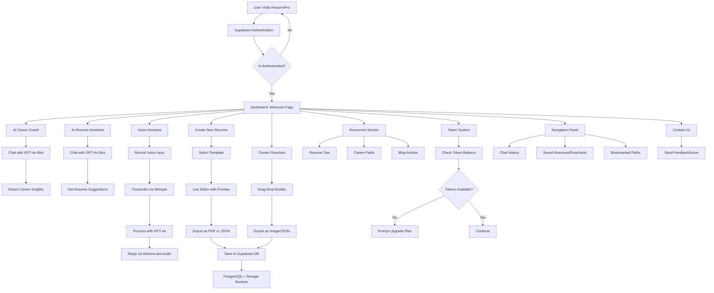

# ResumePro-Your Professional Resume Builder and Career Assistant

**ResumePro** is a full-stack AI-powered resume builder and career assistant platform. It allows users to build personalized resumes from scratch, receive AI-enhanced feedback, and explore career insights—seamlessly integrated into a rich and interactive UI.

---

## 🚀 Features

### 🧠 1. AI Career Coach
An LLM-based (GPT-4o Mini) career guidance assistant that helps users understand career paths, scope of various domains, and job market trends through an interactive chatbot experience.

### ✍️ 2. AI Resume Assistant
An AI resume enhancer chatbot fine-tuned to provide language upgrades, formatting suggestions, and bullet-point enhancements to elevate resume quality and make it recruiter-ready.

### 🎙️ 3. Voice Assistant
For voice-preferred users:
- **Speech-to-Text**: Powered by OpenAI Whisper.
- **Text-to-Speech**: Enabled via ElevenLabs.
This feature allows conversation with the AI assistant through natural voice input and audio responses.

### 📄 4. Create New Resume
Start from scratch by selecting from pre-made templates:
- Choose photo/no-photo, color schemes, columns, etc.
- Real-time live preview while editing.
- Export options: `.json` or `.pdf`.

### 🔁 5. Flowchart Builder
A Whimsical-style interactive flowchart builder:
- Drag-and-drop elements.
- Export as image or `.json`.

### 📚 6. Resources Section
Informational guides and blogs:
- Resume writing tips.
- Detailed career path roadmaps with scope and resources.
- General career development articles.

### 🪙 7. Token-Based Access System
Users receive tokens for LLM interactions. Each API usage (e.g., LLM chat, voice assistant) deducts tokens. Upon exhaustion, users are prompted to upgrade to a premium plan.

### ☎️ 8. Contact Support
A support section for users to reach out with issues, feedback, or personalized assistance.

### 📁 9. Navigation & Dashboard
After Supabase authentication:
- View Chat History with LLMs.
- Access saved resumes and flowcharts.
- Bookmark preferred career paths and guides.

---

## 🔄 Workflow Diagram


---

## 🛠️ Tech Stack

### 📦 Frontend
- **React.js** (Core UI framework)
- **TailwindCSS** (Styling)
- **ShadCN/UI & Lucide React** (Components & Icons)
- **Framer Motion** (Animations)
- **React Router** (Routing & Navigation)
- **Streamlit** (Optional for PDF flow if integrated externally)

### 🧠 AI Services
- **OpenAI GPT-4o Mini** (Career and Resume AI Chatbots)
- **OpenAI Whisper** (Voice-to-text transcription)
- **Eleven Labs API** (Text-to-speech responses)

### 🗃️ Backend & Auth
- **Supabase**
  - **Authentication**: Email-based secure auth system.
  - **Database**: PostgreSQL for storing user data, resumes, flowcharts, token counts, and chat logs.
  - **Storage**: Store exported PDFs, JSONs, and user files securely.

---

## 🧭 Project Workflow

1. **User Authentication**
   - Secure sign-in/sign-up using Supabase Auth.
   - Session management and JWT-based access control.

2. **Dashboard Landing**
   - Post-login, user lands on a centralized dashboard with access to all tools.

3. **AI Features**
   - GPT-4o Mini enables two dedicated chatbots:
     - Career guidance.
     - Resume enhancement.
   - Whisper + ElevenLabs powers the voice assistant loop.

4. **Resume & Flowchart Tools**
   - Users can start resume building via template selection and live editing.
   - Flowchart creator mimics real-time design tools with easy export.

5. **Token System**
   - Each interaction (LLM, voice) consumes tokens.
   - Token tracking and upgrade prompts handled via backend logic.

6. **Resource Exploration**
   - Educational content, career pathways, and job-readiness content fetched from Supabase DB and rendered dynamically.

7. **User Data Storage**
   - Resumes and flowcharts saved per-user.
   - Chat histories preserved for future reference.

---

## 🔐 Authentication & Database Setup (Supabase)

### Step 1: Set Up Supabase Project
- Create project at [https://supabase.com](https://supabase.com)
- Get API keys & Project URL.

### Step 2: Authentication Setup
- Enable **Email** authentication.
- Customize confirmation emails if needed.

### Step 3: Database Schema
Backend Tables Created:
- `users`: Authenticated user profiles.
- `resumes`: Stores JSON/PDF resume records.
- `flowcharts`: JSON/image-based flowcharts.
- `chats`: Chat logs with LLMs.
- `tokens`: Token balance and history.

### Step 4: Storage Buckets
- Setup buckets for:
  - Resume PDFs
  - Flowchart images
  - Profile data exports

---

## Project info
**Use your preferred IDE**

If you want to work locally using your own IDE, you can clone this repo and push changes. 
The only requirement is having Node.js & npm installed - [install with nvm](https://github.com/nvm-sh/nvm#installing-and-updating)

Follow these steps:

```sh
# Step 1: Clone the repository using the project's Git URL.
git clone <YOUR_GIT_URL>

# Step 2: Navigate to the project directory.
cd <YOUR_PROJECT_NAME>

# Step 3: Install the necessary dependencies.
npm i

# Step 4: Start the development server with auto-reloading and an instant preview.
npm run dev
```
---
---

## 👨‍💻 Creator

**Made with ❤️ by [Madhav S Baidya]**  
**IIT (BHU) Varanasi**

If you found this project useful or inspiring, feel free to connect, contribute, or reach out for collaboration.

